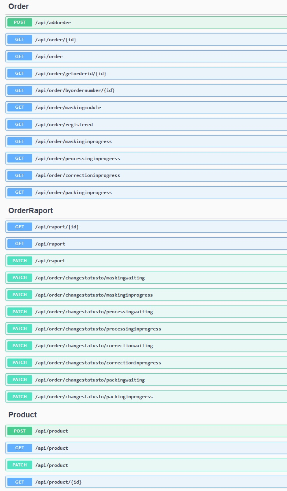

# OrderFlowStudio App

Application to handle with production orders and its statuses during process steps.
For frontend app refer to folder OrderFlowStudio.Frontend.
For backend api refer to folder OrderFlowStudio.Api

## General Information

In order to ensure a stable flow of the materials in factory, knowing statuses of producing materials on its process steps is essencial.
There are processes that takes hours to finish and not knowing the status of processing material can be confusing for Production Planers.
Production planners would like to know if the order is beeing started and processed what is a status for subprocesses.
The statuses are needed to estimate time of sending the order to next operations or directly to customer.

## The problem

The painting line and its process takes around 2.5 - 6 hours to process the order.
There is no feedback to Production Planist about order statuses that are being processes in the area.
The statusses essential for Production Planist are:
* is the order is started,
* is all pcs are processed correctly,
* is the correction process needed for the order,
* is the correction process finished for the order,
* How many pcs are finished and ready to send to customer.

At present Production Planist get this feedback after 8 - 24 hours many times that cause problem with material flow.

## The solution:

The main idea is to collect order statuses of processing orders in couple stages in order to present clear overview of order statuses for Production Planist.
orderFlowStudio is dividing painting process into sub processes and handle with order statuses basis on the process stages.
Process stages:
* Stage : Registered                | Order registered in area.
* Stage : Waiting for masking       | Order is waiting for masking process.
* Stage : Masking in progress	    | Order is being masked.
* Stage : Waiting for processing    | Waiting for order processing.
* Stage : Processing in progress    | Order is being processed.
* Stage : Waiting for correction    | Order is waiting for correction after process.
* Stage : Correction in progress 	| Order is in correction process.
* Stage : Waiting for packing 		| Order is waiting for packing process
* Stage : Packing in progress       | Order is in pracking process. 
* Stage : Finished 		            | Order is finished and ready for shipment.

## Technology stack:

* C#, 
* .NET 8.0, 
* Blazor
* Razor
* MSSQL
* Entity Framework
* Docker
* docker-compose

## Architecture
* Onion Architecture.
* MVC

## Features

* Repor of statuses of orders at productiong line area.
* Register orders in area.
* Update status of orders in each stage of orders processing.
* Changing statuses of order by painting line operators.
* Dedicated web page for each production stand on production line.

## Endpoints - Swagger 

## Installation

To build backend api you need:
* Install docker desktop
* Clone repository OrderFlowStudio.Api
* In terminal write: docker compose up to build database
* run backend in VS
btw,
Database will be seeded with base data.

To build frontend app you need:
* Clone repository OrderFLowStudio.Frontend
* Run it in VS

## Creator

Created by Lukas Zlocki  
